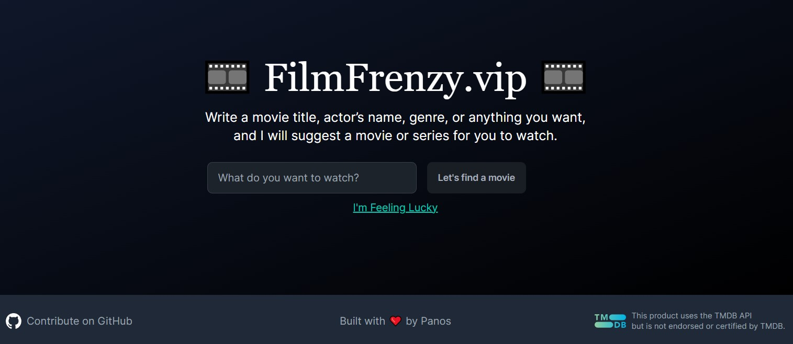

# FilmFrenzy.vip

Welcome to FilmFrenzy.vip! 🎞️ This project is a movie recommendation app where you can search for movies by title, actor, genre, or simply let the app pick a movie for you with the "I'm Feeling Lucky" feature.

## Features

- 🎬 Search for movies by title, actor's name, genre, or any keyword.
- 🎲 "I'm Feeling Lucky" button for random movie suggestions.
- 📺 Watch trailers directly within the app.
- 🎨 Responsive design, optimized for both mobile and desktop.

## Getting Started

First, clone the repository and install the dependencies:

```bash
git clone https://github.com/paaggeli/filmfrenzy.vip.git
cd filmfrenzy.vip
npm install
```

Then, run the development server:
```bash
npm run dev
```
Open [http://localhost:3000](http://localhost:3000) with your browser to see the result.

## Environment Variables
You'll need to set up the following environment variables in a .env.local file:
```env
TMDB_KEY=your_tmdb_api_key
```

## Contributing
We welcome contributions! Before starting any work, please open an issue to discuss the feature or bug you want to address. Once we agree that it's a valuable addition or necessary fix, you can proceed with the development process.

1. **Open an Issue**: Describe the feature or bug in detail.
2. **Discussion and Agreement**: We'll discuss the issue and agree on the approach.
3. **Fork the Repository**: (`git clone https://github.com/paaggeli/filmfrenzy.vip.git`)
4. **Create a Feature Branch**: (`git checkout -b feature/AmazingFeature`)
5. **Commit Your Changes**: (`git commit -m 'Add some AmazingFeature'`)
6. **Push to the Branch**: (`git push origin feature/AmazingFeature`)
7. **Open a Pull Request**: We'll review your changes and merge them after approval.

## License
Distributed under the MIT License. See LICENSE for more information.

## Acknowledgements
- This product uses the TMDB API but is not endorsed or certified by TMDB.
- Built with ❤️ by [Panos](https://twitter.com/PanosAngel1).
